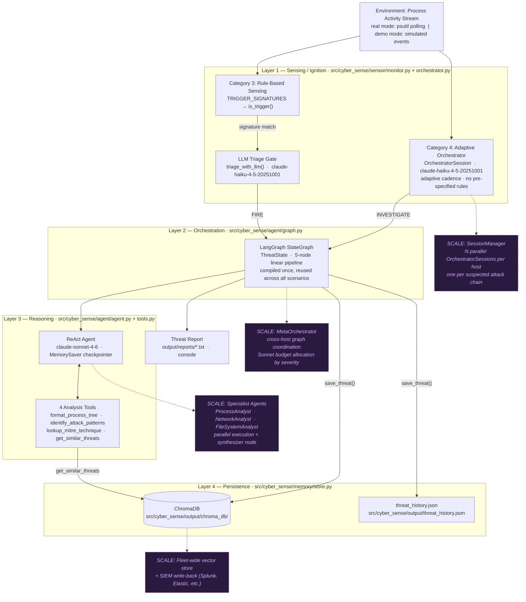
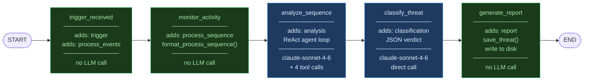
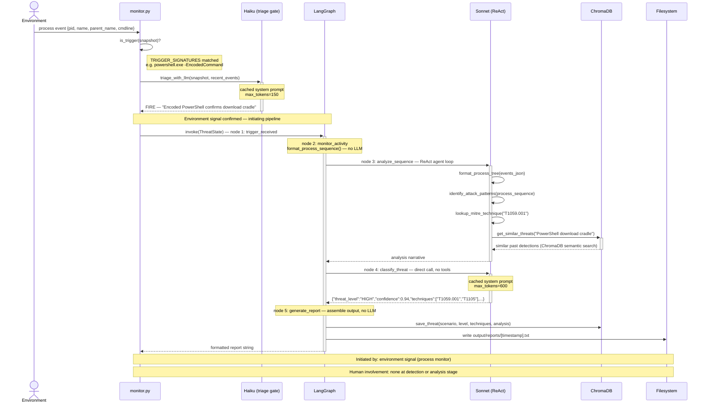
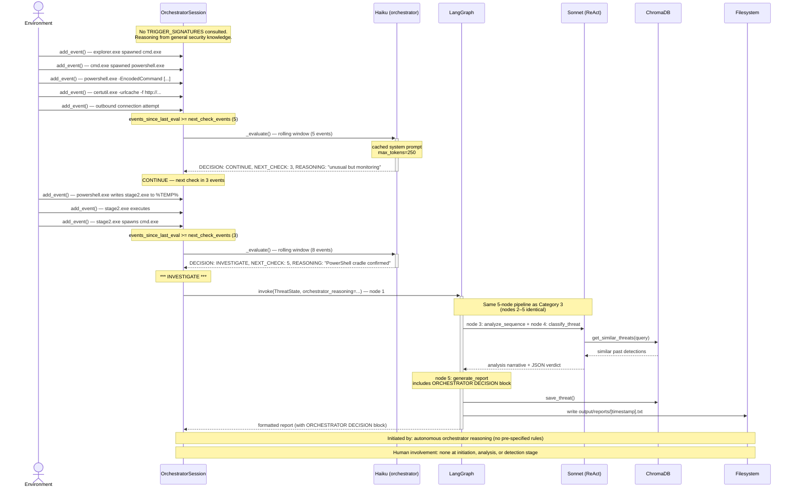
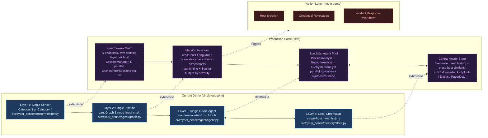

# cyber-sense Architecture

> Architecture reference for the initiation-autonomous cybersecurity agent built to accompany [The Ignition Problem](./the-ignition-problem-v3.md).

The system demonstrates one architectural argument: **initiation autonomy** is a property of the surrounding infrastructure, not the agent itself. The sensing layer detects a threat and fires the pipeline — no human is in the initiation path. Environment changes; sensor fires; agent reasons and reports.

All five diagrams render natively in GitHub, VS Code (Mermaid Preview extension), and Notion. To view locally install the [Mermaid Preview](https://marketplace.visualstudio.com/items?itemName=bierner.markdown-mermaid) VS Code extension and open this file in the preview pane.

---

## 1. Four-Layer System Architecture

Components and data flows across all four layers. Dashed purple nodes are production-scale extension points scaffolded in `src/cyber_sense/sensor/orchestrator.py` and documented in the README.

---

## 2. LangGraph Pipeline — Node Detail

Internal view of the five-node pipeline. Each node reads the full `ThreatState`, adds its field(s), and passes the accumulated state forward. No branching; no loops; no shared mutable state between nodes.

**ThreatState fields accumulated by pipeline completion:**

| Field | Set by node | Content |
|---|---|---|
| `trigger` | trigger_received | snapshot dict that fired the sensor |
| `process_events` | trigger_received | full event list from monitoring window |
| `process_sequence` | monitor_activity | formatted process tree string |
| `analysis` | analyze_sequence | ReAct agent narrative |
| `classification` | classify_threat | `{threat_level, confidence, techniques, reasoning, recommended_actions}` |
| `report` | generate_report | final formatted report string |
| `orchestrator_reasoning` | set at invoke | empty in Category 3; orchestrator text in Category 4 |

---

## 3. Sequence Diagram — Category 3: Rule-Based Ignition

The rule-based sensing path: a hard-coded signature match gates a Haiku triage call, which confirms before the full Sonnet pipeline fires.

---

## 4. Sequence Diagram — Category 4: Adaptive Orchestrator Ignition

The orchestrator path: no trigger signatures are consulted. The `OrchestratorSession` evaluates a rolling event window at adaptive intervals and decides autonomously when to investigate.

---

## 5. Scalability Extension Map

The demo runs one sensor and one pipeline on one endpoint. The architecture is designed so each layer extends to fleet scale independently. Blue = current demo. Purple dashed = production extension points.

---

## Key Design Decisions

**Sensing and reasoning are separate layers with an identical callback interface.**
All three sensing modes (`watch_real`, `watch_simulated`, `watch_with_orchestrator`) share the same callback signature: `callback(snapshot, events[, orchestrator_reasoning])`. The pipeline cannot distinguish real from simulated events, or Category 3 from Category 4 ignition. This means the demo runs without elevated permissions or live threats while preserving the exact production architecture pattern. Swapping the event source does not touch any downstream code.

**The callback interface is the architectural seam.**
The line `callback(snapshot, events)` is where initiation autonomy lives. Everything to the left of that call is the ignition infrastructure (sensing, triage, orchestration decisions). Everything to the right is the analysis pipeline. The two halves are independently upgradeable. Category 4 replaced Category 3's rule-based gate with LLM reasoning without changing a single line of the pipeline.

**The five-node pipeline is deliberately linear.**
No branching, no parallel nodes, no conditional edges. Each node has one responsibility, reads the full `ThreatState`, adds its field(s), and passes forward. This makes the state transformation inspectable at each step (demonstrated in notebook Section 5) and keeps the graph trivially testable. Branching (e.g. routing high-confidence verdicts to an escalation path) is a production addition, not needed for the architectural argument this demo makes.

**The demo ends at report generation; the production system does not.**
In this demo the action layer is a printed report. In production the same pipeline would feed host isolation, credential revocation, or incident response workflow triggers. The cost of a false positive, a missed trigger, or an adversarially crafted signal scales directly with how consequential the downstream action is — which is why the sensing layer and triage gate are the system's highest-leverage security boundary, not an afterthought.
